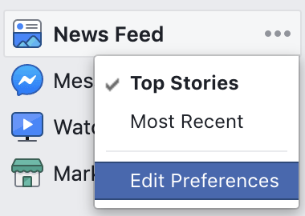

# unfollow

How to (somewhat programmatically) unfollow many people at once on various social media platforms

This is mostly for my own reference, though you're welcome to use these methods (at your own risk—if you don't understand the scripts, I wouldn't recommend using them)

## Facebook

On the FB homepage, go to the left sidebar and click the 3-dot icon next to **News Feed**, then select **Edit Preferences**.



Then expand the section called "Unfollow people and groups to hide their posts"

The following script clicks all the icons of people/groups/pages, thereby unfollowing each of them. It waits 2 seconds between each click to avoid Facebook blocking bot-like behavior. I adapted it from [this Gist](https://gist.github.com/renestalder/c5b77635bfbec8f94d28).

```
var unfollowButtons = document.querySelectorAll('div[aria-pressed="false"]');
unfollowed = 0;
for (var i = 0; i < unfollowButtons.length; i++) {
  setTimeout(function(element) {
    element.click();
    unfollowed++;
    console.log('Total unfollowed ' + unfollowed + ' out of ' + unfollowButtons.length)
  }, i * 2000, unfollowButtons[i])
}
```

## Twitter

Follow the instructions for this [Twitter CLI](https://github.com/sferik/t).

Personally, I ran this command a bunch of times (with larger numbers for `head -#`), since it was interesting to see who hadn't tweeted in the longest time.

```
t followings -l --sort=tweeted | head -10 | awk '{print $1}' | xargs t unfollow -i
```

If I recall correctly, I was following about 800 people and ran into the rate limit once, which reset within 10 minutes.

## LinkedIn

Go to the [page that lists everyone you follow](https://www.linkedin.com/feed/following/) and run this script (from [How can I unfollow all my contacts on LinkedIn at once?](https://webapps.stackexchange.com/questions/92383/how-can-i-unfollow-all-my-contacts-on-linkedin-at-once)) in your browser's console.

Since the script uses jQuery (`$` selectors), you'll have to copy jQuery's [source code](https://code.jquery.com/jquery-3.4.1.min.js) and paste it into the console first 🙃

```
var buttons = $("button"),
 interval = setInterval(function(){
 var btn = $('.is-following');
 console.log("Clicking:", btn);
 btn.click();
 if (buttons.length === 0) {
    clearInterval(interval);
 }
 window.scrollTo(0,document.body.scrollHeight);
}, 1000);
```

This might take a few sessions (refresh and run the script again).

## Instagram

The rate limit in a browser/desktop is super low, so I just unfollowed everyone manually in the app!
